# Developing Mobile Application
## To-Do List Application
#### This is TODO app which is capable of taking notes ,using the Android Architecture Component libraries (Room, ViewModel, LiveData),a RecyclerView, fragments and Java. The data will be stored in an SQLite database and supports insert, read, update and delete operations.Together, this whole structure constitues an MVVM (Model-View-ViewModel) architecture, which follows the single responsibility and separation of concerns principles.

### User Guide
#### 1. Register/ Sign Up: Fill the Required Information and Sign Up.
#### 2. Login: After Signing Up Login with the same credentials.
#### 3. Todo List: Click on the floating Add icon and create the Todo Item
#### 4. Editing the Todo Items: Click on the Todo Item and edit it and click on the update button.
#### 5. Deleting a todo item: Click on the Todo Item and click on the delete button or swipe right or left to delete the item. 
#### 6. Delete the entire list: For deleting the entire list click on the option menu and select delete all tasks.
#### 7. Logout : Click on the option menu and click on logout.
## App Screenshots
| Splash  | Login | Register |
| ------------- | ------------- |------------- |
| 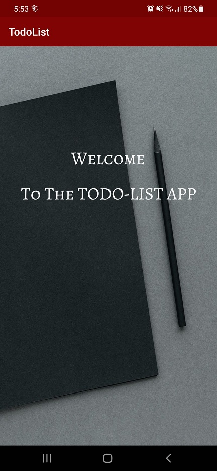 | 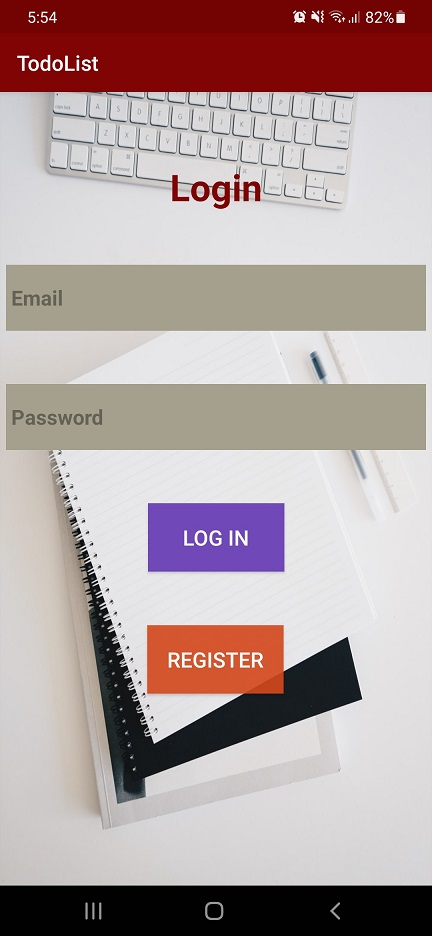  | 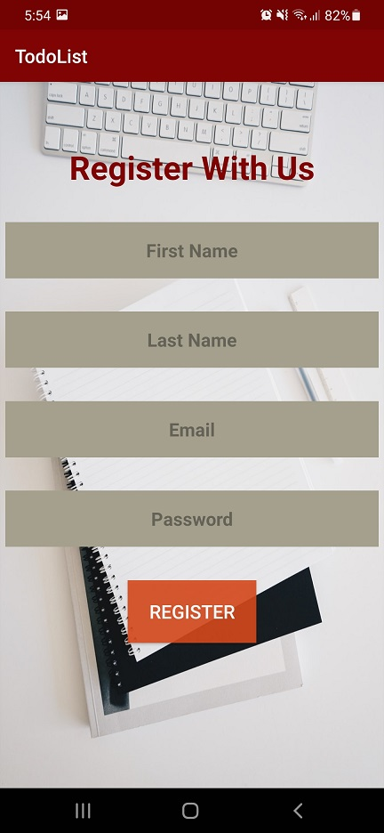  |
#
| Login validation  | App Interface |
| ---------- | ---------- |
| 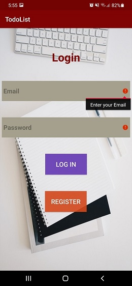  | 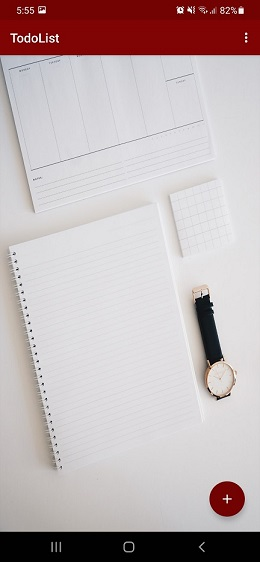  |
#
## Adding Task
| Adding Task Activity  | Adding Task to the list | Task Added to the list |
| ------------- | ------------- |------------- |
| 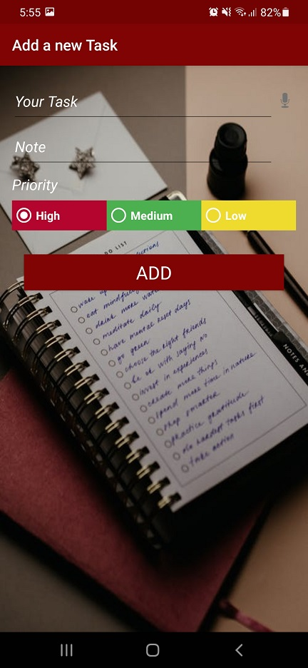 | 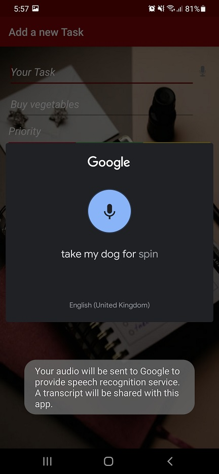  | 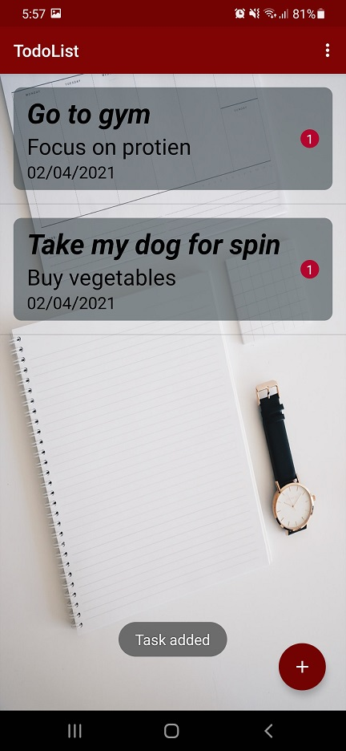  |
#
## Update Task
| Updating Task from the list | Task Updated |
| ---------- | ---------- |
| 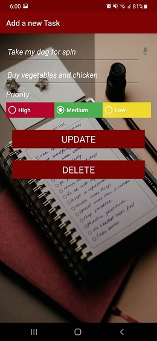  | 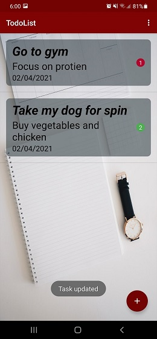  |
#
## Delete Task
| Delete Task from the list | Task Deleted from the list | All Task Deleted |
| ---------- | ---------- |
|   | 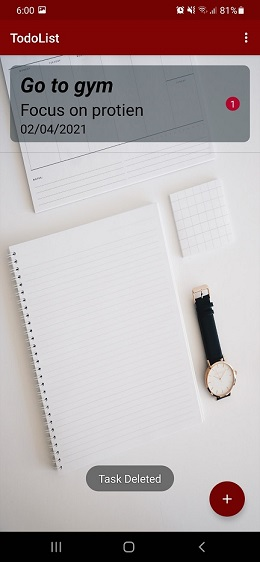  | 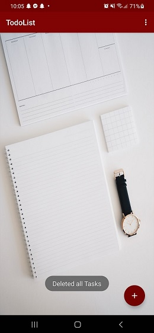  |
#
## Logout
| Option Menu | Logging out |
| ---------- | ---------- |
| 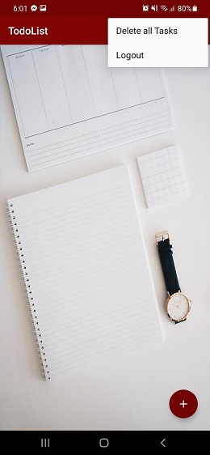  | 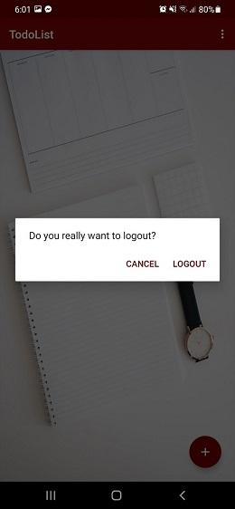  |
#
## GIF
| Login  | Adding Task to list | Updating Tasks |
| ------------- | ------------- |------------- |
|  |   |   |
#
| Deleting Tasks from the list  | Logging Out |
| ------------- | ------------- |
|  |   |
